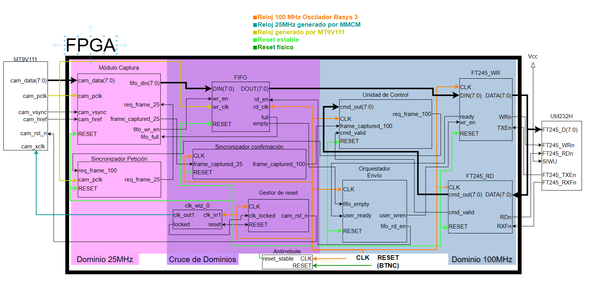

# VICON: Configurable Vision System (Hardware Subsystem)

**VICON** is a hardware-software co-design project developed as a Master's Thesis (TFM) for the Master's Degree in Electronic Systems for Smart Environments at the University of Málaga (UMA). 

This repository contains the **Hardware Subsystem** of the project. It provides the VHDL descriptions, finite state machines (FSMs), and constraints required to configure a Digilent Basys 3 FPGA. The hardware is responsible for capturing real-time video from a CMOS sensor, managing clock domain crossing (CDC) through internal Block RAM FIFOs, and packaging the payload for high-speed transmission via an asynchronous USB interface.

To explore the C++/Qt desktop application that receives and processes this video stream, see the VICON_UI repository [here](https://github.com/JesusMLastre/VICON_UI).

## Physical Architecture

*Figure 1: VICON Physical Architecture Block Diagram*

The system architecture is strictly modular, dividing the physical capture from the software processing. The hardware pipeline consists of the following blocks:

1. **Camera (MT9V111):** The physical optical sensor. It digitizes the environment and transmits the image data synchronously at a 25 MHz clock domain. It also receives physical configuration commands via dedicated I2C control lines.
2. **FPGA (Basys 3):** The core of the low-level acquisition system. It handles the synchronization of the incoming optical frames and acts as a bidirectional control gateway between the camera and the PC.
3. **USB Interface (UM232H-B):** The high-speed communication bridge. It connects the FPGA's parallel bus to the PC's USB port, transforming the synchronous data bursts into a serial stream using the FT245 asynchronous FIFO protocol.
4. **PC:** The host environment running the `VICON_UI` software, providing the visual monitoring and biometric feedback.

## Repository Structure

This repository includes all the necessary RTL files and constraints to synthesize the project in Xilinx Vivado:

* `TOP.vhd`: The top-level entity integrating the camera acquisition, FSMs, and USB communication modules.
* `FT245_IF.vhd`: The dedicated module handling the FT245 asynchronous protocol handshake and timing.
* `Basys3_GPIO.xdc`: The Xilinx Design Constraints file, mapping the RTL ports to the physical pins of the Basys 3 board.
* `sim*.tcl`: A collection of TCL scripts used for automated behavioral simulation and testbench execution in Vivado.

## Hardware Requirements
To deploy and test this RTL design, the following physical setup is required:
* **FPGA Board:** Digilent Basys 3 (Xilinx Artix-7).
* **Optical Sensor:** CMOS MT9V111 module.
* **USB Controller:** FTDI UM232H-B module.

## Synthesis and Implementation
1. Create a new RTL project in Xilinx Vivado targeting the Artix-7 FPGA (xc7a35tcpg236-1).
2. Add all the `.vhd` files from this repository as design sources.
3. Add the `Basys3_GPIO.xdc` file as the physical constraint file.
4. Run the provided `.tcl` scripts in the Vivado console to verify the behavioral simulations.
5. Generate the bitstream and program the Basys 3 device.
